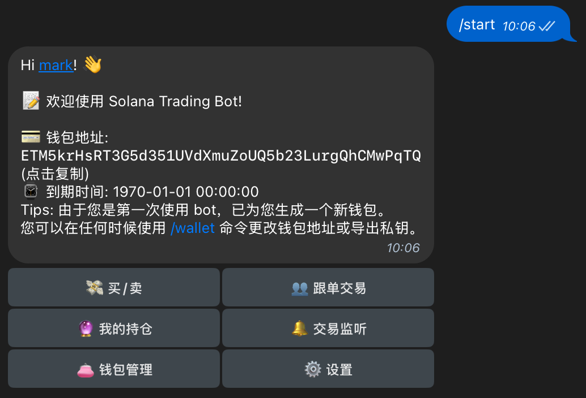

# 🤖 OpenSolBot

一个完全开源的 Solana 链上交易机器人，支持跟单交易和自动交易功能。 ⚡️

> 💡 这是一个开源的交易机器人项目，参考了 GMGN Bot 的实现。本项目完全开源，私钥由您自己保管，避免资产泄露风险。

## ⚠️ 免责声明

本项目仅作为个人学习和研究使用，不作为生产级别项目：

- 🎓 这是一个练习作品，主要用于学习和研究目的
- ⚠️ 不建议在生产环境中直接使用
- 📢 作者不对使用本项目造成的任何损失负责
- 💡 如果您决定使用本项目，请自行承担相关风险

## 🎯 演示



> 🤖 前往体验: [https://t.me/open_sol_bot](https://t.me/open_sol_bot)  
> 💬 交流群组: [https://t.me/opensolbot](https://t.me/opensolbot)
> 
> ⚠️ **警告**：此机器人仅供测试体验使用
> - ❌ 请勿导入个人钱包
> - ❌ 请勿向钱包充值
> - 📢 测试数据可能随时被清除
> - 🔬 仅用于功能演示和测试

## ✨ 主要功能

- 💬 Telegram Bot
- 📊 跟单交易功能
- 🔍 监控功能
- 🎫 激活码系统
- 🔒 安全开源

## 💻 环境要求

- 🐍 Python 3.10+
- 📦 MySQL
- 🗄️ Redis
- 🐳 Docker (Recommended)

## 📥 快速开始

```bash
git clone https://github.com/mkdir700/open-sol-bot.git
cd open-sol-bot
```

## ⚙️ 配置说明

复制并编辑配置文件：

```bash
cp example.config.toml config.toml
```

### 必要配置

- `tg_bot.token`: Telegram Bot Token（[如何创建 Bot Token](https://core.telegram.org/bots#how-do-i-create-a-bot)）
- `rpc.endpoints`: RPC 节点列表
- `api`: API 配置, 包括 [Helius](https://helius.dev) 和 [Shyft](https://shyft.to)，这些 API 有一定的免费额度，对于个人而言已经足够了。
  ```
  [api]
  helius_api_base_url = "https://api.helius.xyz/v0"
  helius_api_key = ""
  shyft_api_base_url = "https://api.shyft.to"
  shyft_api_key = ""
  ```

### 优化配置（可选）

为了获得更快的跟单速度，建议：

- 将 `monitor.mode` 设置为 `geyser`（默认为 wss）
- 配置 `rpc.geyser` 节点信息

> 💡 使用 Geyser 模式可以显著提高监听速度，建议在正式环境中使用。

## 🚀 使用说明

使用 Docker 运行：

```
make up
```

停止服务:

```
make down
```

详细部署文档：[https://github.com/mkdir700/open-sol-bot/wiki/Deployment](https://github.com/mkdir700/open-sol-bot/wiki/Deployment)

## ❓ 常见问题

### 交易未上链，在 Solscan 上查询不到？

这通常是由于网络拥堵导致的。如果默认的交易费用参数（`unit_price` 和 `unit_limit`）设置过低，交易可能无法被及时处理。建议调整配置文件中的这两个参数到更高的值，例如：

```toml
unit_limit = 81000  # 计算单位上限
unit_price = 3000000  # 每计算单位的价格（lamports）
```

> 💡 提示：
> - 这些参数决定了交易的优先级
> - 网络拥堵时适当提高可以加快交易处理速度
> - 后续版本将支持自动动态调整交易费用

## ⚠️ 注意事项

- 🔒 请确保配置文件中的私钥安全
- 💡 建议先使用小额资金测试
- 🌟 确保 RPC 节点的稳定性和可用性

## 🙏 特别致谢
- Raydium 交易模块参考自 [AL-THE-BOT-FATHER/raydium_py](https://github.com/AL-THE-BOT-FATHER/raydium_py)
- Pump 交易模块参考自 [wisarmy/raytx](https://github.com/wisarmy/raytx/blob/main/src/pump.rs)

## 📄 许可证
[MIT License](./LICENSE)
